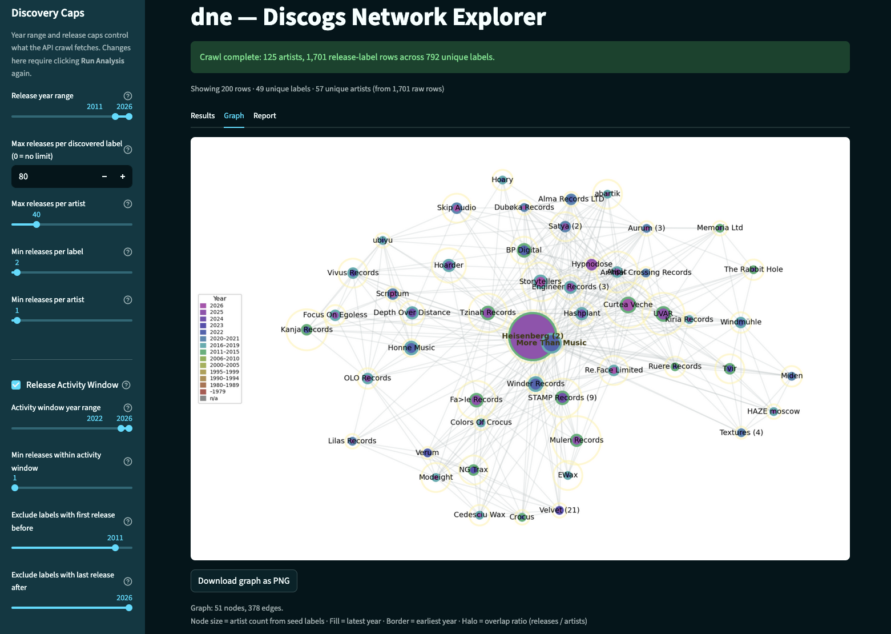

# dne — Discogs Network Explorer



A Streamlit app for exploring relationships between Discogs labels and artists. Crawls the Discogs API to discover which labels share rosters, visualises the network as an interactive graph, and exports results as a multi-sheet Excel report.

## Requirements

- Python 3.10 or newer
- A [Discogs personal access token](https://www.discogs.com/settings/developers) (free account required)

## Installation

```bash
git clone https://github.com/n7cody/discogs-network-explorer.git
cd discogs-network-explorer
pip install -e .
```

## Running the app

```bash
dne
```

This opens the app in your browser. Paste your Discogs token into the **Authentication** field in the sidebar before running any analysis.

Optionally store your token in a `.env` file at the repo root so you do not have to paste it each session:

```
DISCOGS_TOKEN=your_token_here
```

## Seed modes

| Mode | What it does |
|------|-------------|
| **Labels Only** | Finds all labels that share artists with one or more seed labels |
| **Labels + Artists** | Requires every discovered label to also contain specific seed artists |
| **Artists Only** | Finds labels that share a minimum number of artists from an explicit artist ID list |

## Discovery settings (sidebar)

| Setting | Description |
|---------|-------------|
| Year range | Restrict releases to a date window |
| Max releases per label | How many releases to crawl per label (default 40) |
| Max releases per artist | How many releases to crawl per discovered artist (default 40) |
| Min releases per label | Drop labels with fewer than N total releases in the dataset |
| Min releases per artist | Drop artists with fewer than N total releases in the dataset |
| Release Activity Window | Require labels/artists to have releases within a specific year span |
| Max global releases | Skip labels whose total Discogs catalogue exceeds this threshold |

## Network graph

Two graph types are available via **Graph Options** in the sidebar:

- **Label → Label** — undirected graph where edges connect labels sharing at least N artists
- **Artist → Label** — bipartite graph showing which artists appear on which labels

## Excel export

The **Results** tab produces a `.xlsx` file with three sheets:

1. **Run Info** — seed configuration, search parameters, and the discovered/input artist list
2. **All Releases** — every release row pulled during the crawl
3. **Discovered Labels** — one row per label with artist names, overlap percentage, and label ID

## dnx — Discogs Network Xtractor

**dnx** builds YouTube playlists from labels or artists discovered during an analysis. It extracts community-curated YouTube links embedded on Discogs release pages — no YouTube search required for most tracks.

dnx appears at the bottom of the app after running an analysis.

### YouTube API setup (one-time)

dnx uses the YouTube Data API v3 to create playlists. You need a free Google Cloud project:

1. **Create a Google Cloud project**
   - Go to [Google Cloud Console](https://console.cloud.google.com/)
   - Click the project dropdown at the top → **New Project** → give it any name (e.g. "DNX") → **Create**

2. **Enable the YouTube Data API v3**
   - Go to [APIs & Services → Library](https://console.cloud.google.com/apis/library)
   - Search for **YouTube Data API v3** → click it → **Enable**

3. **Configure the OAuth consent screen**
   - Go to [APIs & Services → OAuth consent screen](https://console.cloud.google.com/apis/credentials/consent)
   - Choose **External** → **Create**
   - Fill in the required fields (app name, your email for support contact and developer contact) — other fields can be left blank
   - Skip the **Scopes** step (click Save and Continue)
   - Go to the **Audience** tab (left sidebar) → under **Test users**, click **Add Users** and enter your own Google/Gmail email address
   - Click **Save and Continue** → **Back to Dashboard**

4. **Create OAuth credentials**
   - Go to [APIs & Services → Credentials](https://console.cloud.google.com/apis/credentials)
   - Click **Create Credentials** → **OAuth client ID**
   - Application type: **Desktop app**
   - Name: anything (e.g. "dnx")
   - Click **Create**
   - Click **Download JSON** on the confirmation dialog
   - Save the file as `~/client_secret.json` (or any path — you'll enter the path in the app)

5. **Connect in the app**
   - In the dnx section, enter the path to your `client_secret.json`
   - Click **Connect YouTube** — your browser will open for Google authorization
   - Authorize the app — the token is saved to `~/.dne/youtube_token.json` for future sessions

### YouTube API quota

The free daily quota is 10,000 units. dnx primarily uses Discogs-embedded video links (zero YouTube API cost to discover). The only API calls are playlist operations:

| Operation | Cost |
|-----------|------|
| Create playlist | 50 units |
| Add video to playlist | 50 units per video |
| YouTube search (fallback, off by default) | 100 units per search |

A typical run adding 100 videos costs ~5,050 units — well within the daily limit.

## HTTP cache

Enable **Cache HTTP responses** in the sidebar to store API responses in `discogs_cache.sqlite`. Subsequent runs reuse cached data, making re-analysis near-instant. Clear the cache from the sidebar when you want fresh data.

## Development

```bash
pip install -e .      # editable install — changes to src/ take effect immediately
dne                   # run the app
```
